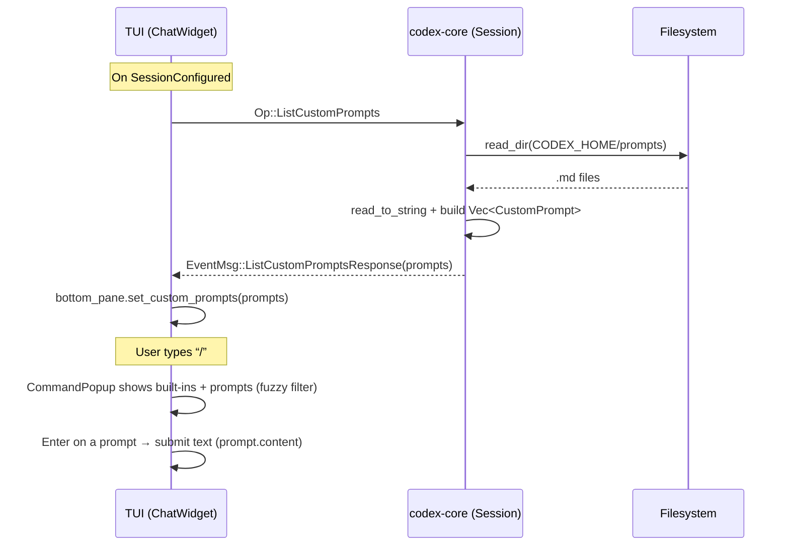
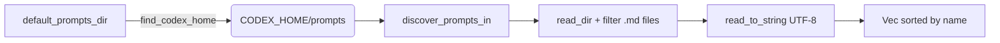

# Custom Prompts – Micro Analysis

This document deep-dives into the Custom Prompts feature: data flow, discovery rules, protocol messages, and TUI integration. It’s aimed at developers new to this part of the codebase.

## Complexity Analysis

- Purpose
  - Custom prompts let users store reusable prompt snippets as Markdown files and inject them quickly via the “slash popup” in the TUI.
- Main components
  - Data type: `codex-protocol::custom_prompts::CustomPrompt { name, path, content }`
  - Discovery: `codex-core::custom_prompts::{default_prompts_dir, discover_prompts_in, discover_prompts_in_excluding}`
  - Protocol: `Op::ListCustomPrompts` → `EventMsg::ListCustomPromptsResponse`
  - TUI: `tui::ChatWidget` requests prompts on session start; `bottom_pane::CommandPopup` shows them; `ChatComposer` inserts selected prompt text
- Difficulty
  - Beginner–intermediate: async fs iteration, serde models, enum routing, fuzzy filter UX

## Visual Diagrams

## Step-By-Step Breakdown

- Discovery and data model
  - `default_prompts_dir()` resolves CODEX home (via `config::find_codex_home()`) and returns `<codex_home>/prompts` if available.
  - `discover_prompts_in(dir)`:
    - Asynchronously reads the directory, ignores non-files, filters `*.md` (case-insensitive), reads file content as UTF-8, and collects `CustomPrompt { name=file_stem, path, content }`.
    - Sorts prompts by `name`. Missing/unreadable dir returns empty list.
  - `discover_prompts_in_excluding(dir, exclude)` same as above but filters out names present in the `exclude` set (e.g., built-in command collisions).
- Protocol request/response
  - TUI sends `Op::ListCustomPrompts` (in `ChatWidget::on_session_configured`).
  - Core handles it in `submission_loop`:
    - Calls `default_prompts_dir()` and `discover_prompts_in(&dir)`.
    - Emits `EventMsg::ListCustomPromptsResponse { custom_prompts }`.
- TUI consumption and UI
  - `ChatWidget::dispatch_event_msg` routes the event to `on_list_custom_prompts`.
  - `on_list_custom_prompts` forwards prompts to the bottom pane: `bottom_pane.set_custom_prompts(...)`.
  - `CommandPopup::new(prompts)`:
    - Excludes prompts whose `name` collides with built-in slash commands.
    - Maintains `builtins + prompts` list; fuzzy filters based on user typing after “/”.
    - Displays built-ins first when filter is empty; otherwise sorts matches by fuzzy score then name.
  - `ChatComposer` interactions:
    - If user selects a prompt and presses Enter, composer returns `InputResult::Submitted(prompt.content)` and clears the textarea.
    - If user hits Tab, composer autocompletes “/promptname ” without sending it (cursor moves to end).
- End-to-end
  - Prompt content becomes the user message sent to the agent exactly as stored in the file, enabling fast insertion of saved instructions.

## Interactive Examples

- Create a custom prompt
  - Place `~/.config/codex/prompts/refactor.md` with:
    - “Refactor this module for testability: extract pure functions, add DI points, list risks, estimate time.”
  - Start TUI and type “/refa”; the popup fuzzy-matches “refactor”. Press Enter to submit that content.
- Use Tab completion
  - Type “/refa” then press Tab to fill “/refactor ”, now add file mentions or extra context before sending.

## Common Pitfalls

- Non-UTF-8 content
  - Files with invalid UTF-8 are skipped; ensure prompt files are UTF-8.
- File extension and location
  - Only `.md` files in `<codex_home>/prompts` are discovered; other extensions or directories aren’t picked up.
- Name collisions
  - Prompts whose file stem equals a built-in slash command are excluded from the popup (e.g., a prompt named “init.md” will be filtered).
- Updates not auto-refreshed
  - Prompts are loaded on session start; edits or new files won’t appear until a new session triggers `ListCustomPrompts` again.
- Large prompts
  - Very large prompt content is inserted as a single user message; consider size implications for token usage and readability.

## Best Practices

- Naming
  - Use simple, unique names matching how you’d type “/my-prompt”; avoid collisions with built-ins (e.g., “model”, “init”).
- Organization
  - Keep prompts concise and composable; leverage additional context in the composer instead of overly long templates.
- Content hygiene
  - Store evergreen guidance; add placeholders (like “<file>”) to remind you to add specifics before sending.
- Refresh cadence
  - If you maintain many prompts, restart the session after changes or surface a simple “refresh prompts” action in your workflow.

## YAML Frontmatter

- Overview
  - Prompt files may start with an optional YAML frontmatter block that customizes how prompts appear and run.
  - The block starts with a line `---` and ends at the next line `---`.
- Supported keys
  - `description` – shown in the TUI slash popup listings when present.
  - `argument_hint` – a short hint rendered near autocomplete/help for the prompt.
  - `model` – default model preset to use when running this prompt.
- Model presets
  - Allowed values: `gpt-5-minimal`, `gpt-5-low`, `gpt-5-medium`, `gpt-5-high`.
  - Invalid values fall back to `gpt-5-medium` and emit a warning log.
- Behavior and parsing
  - Frontmatter is parsed only if it appears at the very top of the file.
  - Malformed YAML or a missing closing `---` is ignored; the file is treated as having no frontmatter.
  - Unknown keys and non-string values are ignored.
- Quickstart and examples
  - See the feature quickstart with copy‑paste examples: `/home/iatzmon/workspace/codex/specs/001-support-optional-yaml/quickstart.md`.

## Learning Resources

- Async fs basics
  - Tokio fs APIs (`read_dir`, `read_to_string`) and streams for directory iteration.
- Enums and protocol routing
  - Rust pattern matching over `Op` and `EventMsg` for handler clarity and exhaustiveness.
- TUI UX patterns
  - Fuzzy matching and popup design (see `CommandPopup`, fuzzy_match); ratatui styling helpers for consistent UI.

## Practice Exercises

- Add an in-session Refresh
  - Implement a slash command “/prompts” to re-request `Op::ListCustomPrompts` and update the popup without restarting.
- Exclude Hidden Files
  - Update discovery to ignore dotfiles or temporary files (e.g., `*.swp`, `.#*`), and add a unit test.
- Prompt Preview
  - Extend `CommandPopup` rows to show a one-line preview (first line of content) in dim text for better discovery.
- Folder Support
  - Add simple subfolder support (e.g., “/team/…” prefix), while preserving simple names and fuzzy matching.

---

References
- Protocol: `codex-rs/protocol/src/custom_prompts.rs`, `codex-rs/protocol/src/protocol.rs`
- Core: `codex-rs/core/src/custom_prompts.rs`, `codex-rs/core/src/codex.rs`
- TUI: `codex-rs/tui/src/chatwidget.rs`, `codex-rs/tui/src/bottom_pane/command_popup.rs`, `codex-rs/tui/src/bottom_pane/chat_composer.rs`
